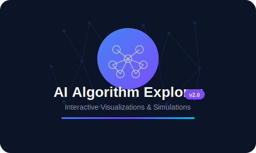
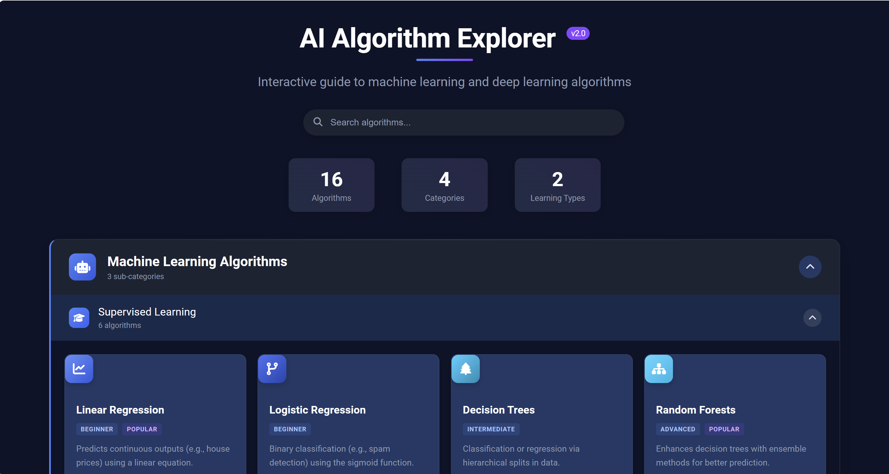
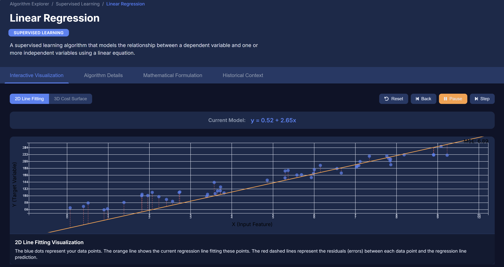
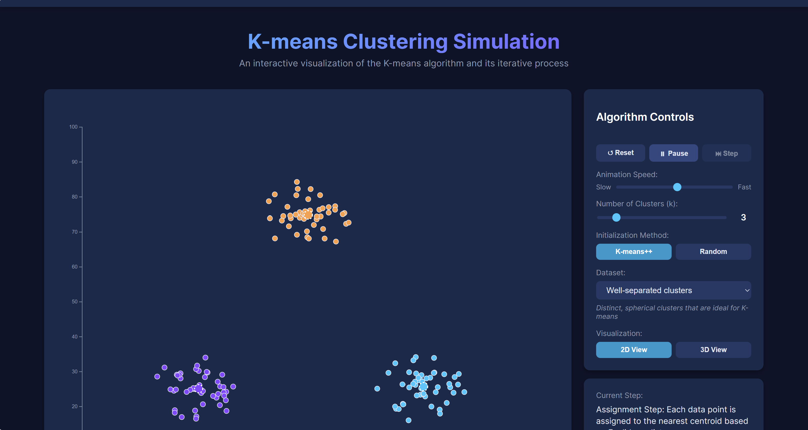
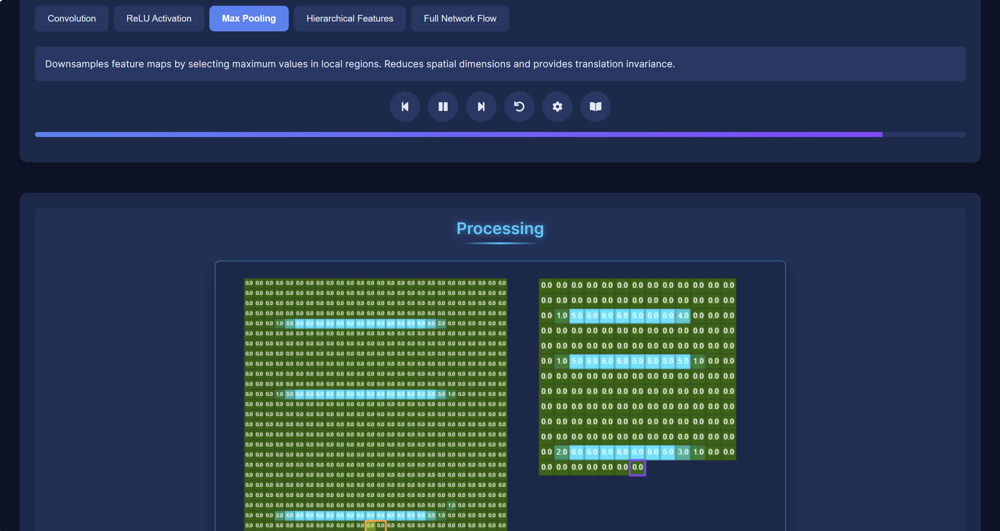
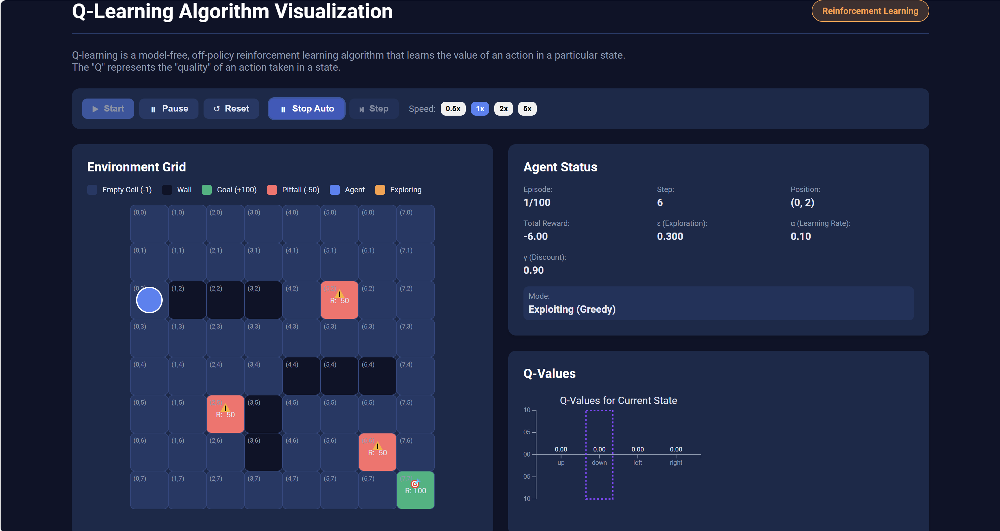

# AI Algorithm Explorer



An interactive Angular application for exploring, visualizing, and simulating machine learning and deep learning algorithms. This modern, visually appealing interface categorizes AI algorithms and provides interactive simulations for each one.

## AI Development Experiment

> This application is an experiment to determine if I could create a complete application using AI without writing any code myself. Note that while I have 7+ years of development experience, I didn't directly write any code - I only used copy-paste for error messages and guided the AI to generate the solution.

## Features

- **Interactive Algorithm Simulations**: Each algorithm has its own dedicated simulation/visualization component
- **Intuitive Category Structure**: Hierarchical organization of algorithms by type (Machine Learning, Deep Learning) and subcategories
- **Interactive UI**: Expandable/collapsible sections with smooth animations
- **Algorithm Cards**: Detailed cards with descriptions, complexity levels, and popularity indicators
- **Real-time Search**: Instantly filter algorithms as you type
- **Visual Indicators**: Color coding and icons to distinguish algorithm types
- **Responsive Design**: Adapts to different screen sizes
- **Statistics Display**: Quick overview of the number of algorithms, categories, and learning types
- **Lazy Loading**: All algorithm simulations are loaded on demand for optimal performance

## Screenshots

### Main Dashboard

*The algorithm dashboard showing categories, subcategories, and algorithm cards*

### Linear Regression Simulator

*Interactive visualization of linear regression with adjustable parameters*

### K-means Clustering

*Dynamic K-means clustering simulation showing centroid movement*

### Convolutional Neural Network

*Layer-by-layer visualization of a convolutional neural network*

### Q-Learning Simulation

*Reinforcement learning environment with real-time Q-table updates*

## Technologies Used

- **Angular**: Framework for building the client-side application
- **TypeScript**: For type-safe code
- **SCSS**: For advanced styling with variables and nested rules
- **Font Awesome**: For iconography
- **Standalone Components**: Modern Angular architecture with standalone components
- **Lazy Loading**: Routes configured for efficient code-splitting
- **Router**: Angular router for navigation between algorithm simulations

## Installation

1. Ensure you have Node.js (14+) and npm installed
2. Clone this repository
3. Install dependencies:
   ```bash
   npm install
   ```
4. Run the development server:
   ```bash
   ng serve
   ```
5. Navigate to `http://localhost:4200/` in your browser

## Usage

- Browse the main dashboard to view all available algorithms
- Expand categories by clicking on the category headers
- Use the search bar to find specific algorithms
- Click on an algorithm card to navigate to its simulation page
- Each algorithm simulation provides interactive controls and visualizations
- Return to the dashboard using the navigation links

## Project Structure

```
src/
├── app/
│   ├── algorithm-dashboard/
│   │   ├── algorithm-dashboard.component.ts    # Main dashboard logic
│   │   ├── algorithm-dashboard.component.html  # Dashboard template
│   │   └── algorithm-dashboard.component.scss  # Dashboard styles
│   ├── algorithms/
│   │   ├── supervised/                         # Supervised learning algorithms
│   │   │   ├── linear-regression/
│   │   │   ├── logistic-regression-simulation/
│   │   │   └── ...
│   │   ├── unsupervised/                       # Unsupervised learning algorithms
│   │   │   ├── kmeans/
│   │   │   ├── pca/
│   │   │   └── ...
│   │   ├── reinforcement/                      # Reinforcement learning algorithms
│   │   │   ├── qlearning/
│   │   │   └── ...
│   │   └── deep-learning/                      # Deep learning algorithms
│   │       ├── cnn/
│   │       ├── rnn/
│   │       └── ...
│   ├── app.component.ts                        # Main app component
│   ├── app.component.html                      # Main app template
│   ├── app.component.scss                      # Main app styles
│   ├── app.routes.ts                           # Application routes
│   └── app.config.ts                           # App configuration
├── assets/
└── ...
```

## Algorithm Simulations

The application includes interactive simulations for the following algorithms:

### Machine Learning Algorithms
- **Supervised Learning**:
  - Linear Regression: Visualize the line of best fit
  - Logistic Regression: Observe the sigmoid function and decision boundary
  - Decision Trees: Explore hierarchical split visualization
  - Random Forests: See ensemble methods in action
  - Support Vector Machines: Visualize hyperplanes and margins
  - Naive Bayes: Understand probabilistic classification

- **Unsupervised Learning**:
  - K-means Clustering: Watch centroids and clusters form dynamically
  - Principal Component Analysis: Visualize dimensionality reduction
  - Autoencoders: See neural compression in action

- **Reinforcement Learning**:
  - Q-learning: Observe agents learning optimal policies
  - Policy Gradient Methods: Watch continuous policy optimization

### Deep Learning Algorithms
- **Neural Network Models**:
  - Convolutional Neural Networks: Visualize filters and feature maps
  - Recurrent Neural Networks: See sequential data processing
  - Long Short-Term Memory Networks: Understand gates and memory cells
  - Generative Adversarial Networks: Watch the generator and discriminator compete
  - Transformers: Explore attention mechanisms and NLP applications

## Future Enhancements

- Add downloadable code examples for each algorithm
- Implement user authentication to save simulation configurations
- Add dark/light theme toggle
- Enable sharing of simulation results
- Create a comparison tool to analyze multiple algorithms side-by-side
- Add interactive tutorials explaining each algorithm step-by-step

## Contributing

Contributions are welcome! Please feel free to submit a Pull Request.

## License

This project is licensed under the MIT License - see the [LICENSE](LICENSE) file for details.